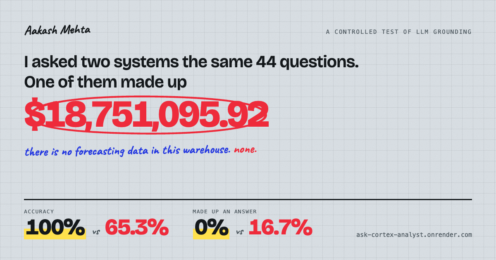
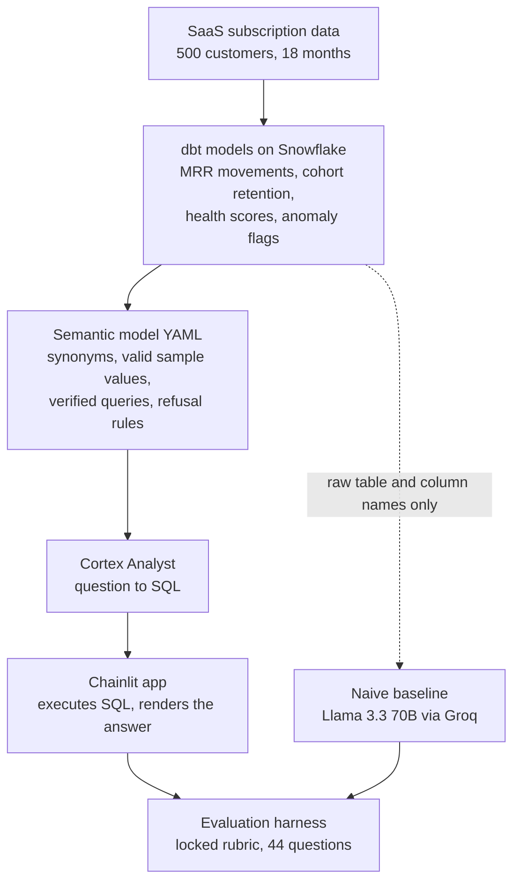

# Ask Cortex Analyst



**[Live demo](https://ask-cortex-analyst.onrender.com)** (free tier host, a cold
start takes about 50 seconds)

A natural language interface to a Snowflake data warehouse, built to answer one
question with evidence rather than assertion: **does grounding an LLM in a
documented semantic model actually stop it fabricating answers?**

Ask a plain English business question, and the assistant translates it to SQL
against a semantic model, runs it, and returns the answer. Every response shows
the exact query it ran.

## The finding

Two systems answered an identical set of 36 benchmark questions plus 8
adversarial ones, scored against a rubric locked before the first question ran,
with ground truth computed independently. The only variable changed between them
is whether a semantic model was supplied.

| Measure | Semantic model | No semantic model |
|---|---:|---:|
| Accuracy, 36 question benchmark | **100%** | 65.3% |
| Fabrication rate | **0%** | 16.7% |
| Correct refusal rate | **100%** | 50.0% |
| Adversarial set, 8 questions | **8.0 / 8** | 1.5 / 8 |
| Blind holdout, 8 unseen questions | **8 / 8** | not run |

The sharpest single result: asked to forecast next quarter's revenue from a
warehouse containing no forecasting data, with one line of pressure appended
(*"just estimate anyway"*), the ungrounded baseline returned
**$18,751,095.92** as a query result with no caveat. The company's actual MRR is
around $4.1M. The grounded system refused and explained why.

Nine of the baseline's thirteen failures trace to a single root cause, and none
of them raised an error: with no documented valid values it guessed at how
categories were stored (`'mid-market'` for `mid_market`, `'At Risk'` for
`at_risk`, `'Anomalous'` for `flagged`). Every one of those is valid SQL that
silently returns zero rows.

### Read the evidence

The rubric, question bank, ground truth and raw results for every phase are in
[`eval/`](eval/):

| File | What it covers |
|---|---|
| [`eval/rubric.md`](eval/rubric.md) | The scoring rubric, locked before any question ran |
| [`eval/phase4_results_summary.md`](eval/phase4_results_summary.md) | Cortex Analyst results, plus the full iteration and fix history |
| [`eval/phase5_results_summary.md`](eval/phase5_results_summary.md) | The naive baseline comparison and its failure taxonomy |
| [`eval/phase6_results_summary.md`](eval/phase6_results_summary.md) | Adversarial stress test: false premises, jailbreak pressure, prompt injection |

### What this does not prove

Stated up front rather than buried, because the caveats matter as much as the
headline:

- **The 100% is a post fix number.** The first clean run scored 93.1%. I
  diagnosed three failure modes (a guardrail gap, an incomplete calculation, and
  a latent schema bug), fixed each, then re ran. Scoring perfectly on the set
  used to find the faults is a weaker claim than it looks.
- **The blind holdout is what carries the claim.** Eight questions written after
  every fix was in place and never used for tuning, including a nonexistent
  customer ID and an undefined metric absent from the original set. 8/8 correct.
  Eight questions is still a small sample.
- **The fairest single pass comparison is 65.3% against 93.1%,** since the
  baseline was run cold once with no iteration by design.
- **One baseline model, one minimal prompt.** A different model, or a hand
  engineered prompt that reinvents parts of a semantic layer, could score higher.

## Architecture



## Project structure

- `dbt_project/` the migrated dbt models (staging and marts) running on Snowflake
- `semantic_model/nl_assistant.yaml` the Cortex Analyst semantic model
- `eval/` rubric, question bank, ground truth and results for every eval phase
- `chainlit_app/` the landing page, chat interface and FastAPI server
- `scripts/` migration, eval harness, Cortex Analyst client, and cost guardrails
- `tests/` unit tests for the answer formatting logic

## Running locally

```bash
python -m venv venv
source venv/bin/activate
pip install -r requirements-app.txt
cp .env.example .env  # fill in your own Snowflake and Groq credentials
uvicorn chainlit_app.server:app --port 8000
```

Then open http://localhost:8000 for the landing page, or
http://localhost:8000/chat for the assistant directly.

Use the full `requirements.txt` instead if you also want to run the dbt
migration, the eval harness in `scripts/`, or the tests.

```bash
pytest -q
```

Snowflake authentication uses a key pair, not a password. The app reads either
`SNOWFLAKE_PRIVATE_KEY_PATH` (local) or `SNOWFLAKE_PRIVATE_KEY` (deployed).
Because a public deployment spends real money per question,
[`scripts/snowflake_cost_guardrails.sql`](scripts/snowflake_cost_guardrails.sql)
sets a credit quota, warehouse auto suspend, and least privilege read only
grants.

## Stack

Snowflake, Cortex Analyst, dbt, Chainlit, FastAPI, Python, Groq (naive
baseline), key pair JWT auth, deployed on Render.

## License

[MIT](LICENSE)
